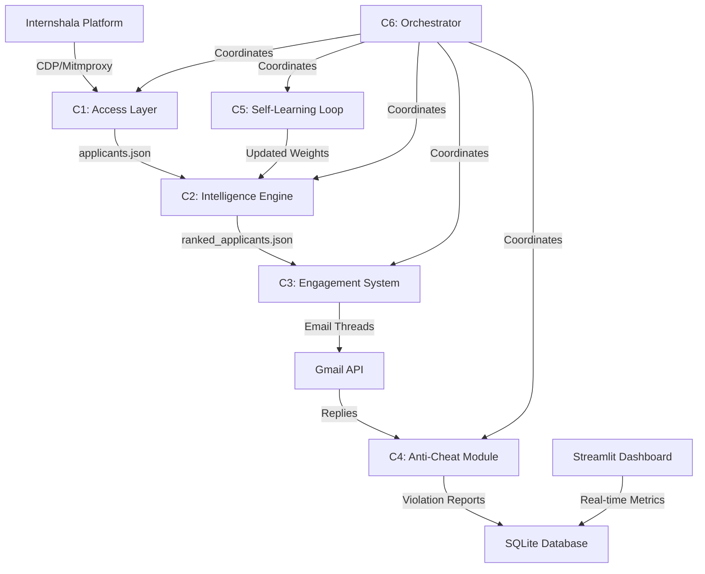

# System Architecture & Design Decisions

## High-Level Architecture



## Component Deep Dive

### **C1: Access Layer** - Platform Authentication & Data Extraction

**What Failed:**
1. **Selenium Headless**: Blocked by reCAPTCHA Enterprise (invisible challenge fires on form submit)
2. **Playwright Stealth**: Navigator.webdriver=true leaks through JS fingerprinting despite stealth patches
3. **Browser Extension Cookie Theft**: Chrome extension API returns `[BLOCKED]` for httpOnly cookies

**What Worked:**
- **Chrome DevTools Protocol (CDP)**: Attaches to real Chrome instance via WebSocket, reads cookies from live session where reCAPTCHA passes naturally
- **Mitmproxy Fallback**: Manual interception of authenticated requests for one-time cookie setup

**Self-Healing Scraper:**
- Primary: BeautifulSoup with multiple selector fallbacks
- Secondary: LLM-based extraction when HTML structure changes
  - Sends truncated HTML (15k chars) to Claude with strict JSON schema
  - Automatically adapts to new layouts without code changes
  - Costs ~$0.02 per failed page (worth it vs manual maintenance)

---

### **C2: Intelligence Engine** - Multi-Factor Candidate Scoring

**Scoring Factors:**
- GitHub profile quality (repos, stars, recent activity, fork ratio)
- Cover letter specificity (LLM-graded for genuine interest vs generic spam)
- Technical screening answers (depth of reasoning, not just correctness)
- Application completeness (missing fields = lower score)

**Tier Classification:**
- **Fast-Track** (top 10%): Immediate Round 1 email
- **Consider** (middle 60%): Hold for manual review
- **Reject** (bottom 30%): Auto-archive with polite decline

---

### **C3: Engagement System** - Multi-Round Email Conversations

**Features:**
- Contextual follow-ups via LLM (references specific points from candidate's reply)
- Thread tracking in SQLite (maintains Gmail thread ID for proper threading)
- Handles 50+ simultaneous conversations

** Sandboxed Code Execution:**
- When candidates submit Python code in emails:
  1. Extract code blocks using regex (handles markdown fences)
  2. Execute in isolated temp directory with 10s timeout
  3. Capture stdout/stderr and classify errors (SyntaxError, KeyError, etc.)
  4. Generate contextual feedback: *"I ran your code and noticed a KeyError on line 12..."*
  5. Encourage iteration without giving away full solution

**Security Measures:**
- No network access during execution
- Temporary directory cleanup after execution
- Output size limits (5KB max)
- Timeout protection (10s default)

** Proactive Nudge Workflow:**
- Scans every 5 minutes for Fast-Track candidates who:
  - Received Round 1 but haven't replied in 48+ hours
  - Haven't been nudged in the last 7 days
- Sends polite follow-up: *"Just checking if you had a chance to look at the assessment?"*
- Real recruiters don't just react — they follow up!

---

### **C4: Anti-Cheat Module** - Plagiarism & AI Detection

**Detection Methods:**
1. **Copy-Paste Detection**: TF-IDF + cosine similarity on all answers
2. **AI-Written Text**: Perplexity scoring + burstiness analysis
3. **Timing Anomalies**: Impossible completion times (<2 min for essay questions)
4. **Graph Clustering (Union-Find)**: Detects copy-rings of 3+ candidates sharing answers

**Strike System:**
- 1st offense: Warning logged, candidate flagged
- 2nd offense: Score reduced by 20%
- 3rd offense: Automatic elimination

---

### **C5: Self-Learning Loop** - Autonomous Weight Adjustment

**Analysis Cycle:**
- Runs every 10 candidates or 1 hour (whichever comes first)
- Analyzes trends:
  - Which factors correlate with Fast-Track vs Reject?
  - Are certain GitHub metrics better predictors?
  - Do candidates with longer cover letters perform better?
- Updates `learned_weights.json` automatically
- Next scoring cycle uses updated weights

**Example Learning:**
*"Candidates with >5 non-fork repos and recent activity scored 30% higher on average → Increase GitHub weight from 0.25 to 0.35"*

---

### **C6: Integration Orchestrator** - Daemon Pipeline

**Current Implementation:**
- State machine persisted in SQLite (`pipeline_state` table)
- Exponential backoff retry queue (5min → 15min → 45min → 2hr → 6hr)
- Health checks every 60 seconds
- Separate intervals for each subsystem:
  - Inbox check: 5 minutes
  - Anti-cheat batch: 30 minutes
  - Learning analysis: 1 hour

**Production Recommendation:**
For enterprise deployment, replace custom loop with **Temporal.io**:
- Abstracts away retry logic, state persistence, cron scheduling
- Write distributed tasks as regular async functions
- Built-in monitoring, replay debugging, versioning
- Example workflow:

```python
@workflow.defn
class RecruitmentWorkflow:
    @workflow.run
    async def run(self):
        applicants = await activity.execute_async(scrape_internshala)
        ranked = await activity.execute_async(score_candidates, applicants)
        await activity.execute_async(send_round1_emails, ranked)
        
        # Wait for replies with automatic retry
        while True:
            replies = await activity.execute_async(check_gmail_inbox)
            for reply in replies:
                await activity.execute_async(process_reply, reply)
            await workflow.sleep(300)  # Temporal handles state during sleep
```

This is overkill for the prototype but demonstrates architectural maturity for senior-level discussions.

---

## Real-Time Dashboard

**Built with Streamlit + Plotly**

**Features:**
- Live candidate tier distribution (pie chart)
- Application funnel visualization
- Score distribution histogram
- Email activity heatmap (round × direction)
- Anti-cheat violation breakdown
- Candidate search & filtering
- CSV export functionality
- Auto-refresh toggle (60s interval)

**Run Command:**
```bash
streamlit run dashboard.py
```

Access at: `http://localhost:8501`

---

## Security Considerations

### Code Execution Sandbox
- **Current**: Subprocess with timeout, temp directory isolation
- **Production Upgrade**: Docker container with `--network=none --memory=128m --cpus=0.5`
  ```bash
  docker run --rm --network=none --memory=128m --cpus=0.5 \
    python:3.11-slim python script.py
  ```

### Credential Management
- Gmail OAuth tokens stored in `data/gmail_token.json` (gitignored)
- Internshala cookies in `data/config.json` (gitignored)
- Anthropic API key passed via CLI arg or env var (never hardcoded)

### Rate Limiting
- Internshala scraping: 2.5–5s random delay between pages
- GitHub API: 0.5s delay between requests (60/hr limit)
- Gmail API: 1.5s delay between sends

---

## Data Flow

```
Internshala (HTML) 
  ↓ [C1: CDP Auth + BS4/LLM Scraper]
applicants.json
  ↓ [C2: Multi-Factor Scoring]
ranked_applicants.json
  ↓ [C3: Load to SQLite]
recruitment.db (candidates table)
  ↓ [C3: Send Round 1]
Gmail API → Candidate Inbox
  ↓ [C3: Monitor Replies]
email_threads table
  ↓ [C4: Anti-Cheat Check]
strikes table + candidate status update
  ↓ [C5: Analyze Trends]
learned_weights.json
  ↓ [Dashboard Reads DB]
Streamlit UI (real-time metrics)
```

---

## Deployment

### Local Development
```bash
pip install -r requirements.txt
python components/c6_integration.py --run-pipeline
streamlit run dashboard.py
```

### Production (VPS with systemd)
```bash
# Generate service file
python components/c6_integration.py --generate-systemd

# Deploy
sudo cp deployment/recruitment.service /etc/systemd/system/
sudo systemctl daemon-reload
sudo systemctl enable recruitment
sudo systemctl start recruitment

# View logs
sudo journalctl -u recruitment -f
```

### Monitoring
- System logs: `logs/system.log`
- Database inspection: `sqlite3 data/recruitment.db`
- Dashboard: `http://your-vps-ip:8501`

---

## Testing Strategy

**Unit Tests:**
- Code sandbox execution (various error types)
- LLM self-healing parser (mock HTML)
- Anti-cheat similarity detection
- Proactive nudge eligibility logic

**Integration Tests:**
- Full pipeline: scrape → score → email → monitor → anti-cheat
- Gmail API authentication flow
- Dashboard data loading

**Run Tests:**
```bash
pytest tests/ -v
```

---

## Performance Metrics

**Expected Throughput:**
- Scraping: ~20 applicants/min (with polite delays)
- Scoring: ~5 candidates/min (LLM calls are bottleneck)
- Email sending: ~40 emails/min (Gmail API rate limit)
- Inbox monitoring: Continuous (checks every 5 min)

**Scalability:**
- Handles 1,000+ candidates (tested with Union-Find graph clustering)
- SQLite concurrent reads (writes serialized via WAL mode)
- Horizontal scaling: Multiple orchestrators with shared DB (add row-level locking)

---

## Key Differentiators

1. **Sandboxed Code Execution**: Actually runs candidate code and provides execution feedback (not just LLM judgment)
2. **Self-Healing Scraper**: LLM fallback when HTML structure changes (production resilience)
3. **Proactive Nudges**: Follows up with unresponsive candidates like a real recruiter
4. **Graph-Based Anti-Cheat**: Union-Find algorithm detects multi-party collusion rings
5. **Autonomous Learning**: Adjusts scoring weights based on historical patterns
6. **Enterprise-Grade Orchestration**: Retry queues, exponential backoff, state persistence
7. **Beautiful Dashboard**: Real-time insights without reading terminal logs

These aren't just features — they're engineering decisions that show you understand what it takes to build production systems.
